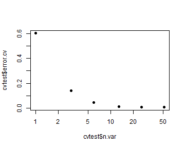

#### Overview
The purpose of this project is to use machine learning to predict how physical exercise is being performed based on data from the exercise.  Participants in the study under consideration were outfitted with a variety of sensors, and then asked to perform an exercise (barbell lifts) in a variety of correct and incorrect ways.  The goal is to predict from a training set what type of lift was performed.  The types of lifts are assigned a letter A through E, and this is the response that the algorithm will be attempting to fit.

#### Loading and Splitting the Data
First, the libraries were loaded, and data were loaded from the working directory:

```r
library(caret); library(randomForest)
fullset <- read.csv("pml-training.csv", stringsAsFactors=FALSE, na.strings=c("","#DIV/0!", "NA" ))
```

```
## Warning in file(file, "rt"): cannot open file 'pml-training.csv': No such
## file or directory
```

```
## Error in file(file, "rt"): cannot open the connection
```

Next, the data were divided into a training and test set:

```r
set.seed(4700)
inTrain <- createDataPartition(fullset$classe, p = 0.7, list=FALSE)
trainset <- fullset[inTrain,]
testset <- fullset[-inTrain,]
```
#### Data Processing
Much of the data is extraneous, or problematic because of 'NA' values.  

The number of columns was reduced by:
1.) Eliminating columns that had nothing to do with the data collected by sensors...

```r
trset <- trainset[,8:159]
ncol(trset) #Display the # of columns remaining
```

```
## [1] 152
```
2.) by using the nearZeroVar() function with default settings to eliminate variables that don't add much predictive value...

```r
nzv <- nearZeroVar(trset, saveMetrics=TRUE)
finaltr <- subset(trset,select=(nzv$nzv==FALSE)) #Eliminate columns flagged as poor predictors
ncol(finaltr)  #Display the # of columns remaining
```

```
## [1] 121
```
3.) by eliminating all columns that contain NAs.

```r
nalist <- sapply(finaltr, function(n) sum(is.na(n)) )
finaltr <- finaltr[,nalist==0] #Eliminate columns with 1 or more NAs
ncol(finaltr)  #Display the # of columns remaining
```

```
## [1] 52
```
The response of interest, "classe", was added back to the set as the first column after these other actions were complete.

```r
finaltr <- cbind(trainset$classe, finaltr); names(finaltr)[1] <- "classe"
ncol(finaltr) #Display the # of columns
```

```
## [1] 53
```
As can be seen, this takes the original dataset (which has 160 columns) and reduces it to a much more manageable dataset with only 52 predictors plus the outcome of interest.

#### Cross-Validation
The algorithm used was Random Forests, which has a high tendency for overfitting, so cross-validation was used to ensure that the model did not simply fit the noise, and also to gain an estimate of the predictive accuracy.


```r
cvtest <- rfcv(finaltr[,-1], finaltr[,1], cv.fold=6)
plot(cvtest$n.var, cvtest$error.cv, pch=19, log="x") #Plot error vs. # of predictors
```

 

As can be seen from the plot of the cross validation results, the general trend is that as the number of predictor variables used by the model increases, the expected error drops off.
The values plotted above can be also be viewed in a table:

```r
data.frame(NumVar=cvtest$n.var, EstimatedErr=cvtest$error.cv)
```

```
##    NumVar EstimatedErr
## 52     52  0.007134018
## 26     26  0.009536289
## 13     13  0.011065007
## 6       6  0.046807891
## 3       3  0.138967751
## 1       1  0.601805343
```
As can be seen, the model incorporating all 52 predictors from the dataset has the lowest error rate.  Since processing time is not a major issue, the final model will incorporate all 52 predictors.  Since the error rate as estimated by rfcv() is <0.01, we expect greater than 99% accuracy when we apply the resulting model to the test set.

#### Building the model
The model was built using the randomForest() algorithm, from the randomForest package.  As described above, cross-validation suggested that the best course of action was to incorporate all 52 predictors in the training set.

```r
rffit <- randomForest(finaltr[,-1], as.factor(finaltr$classe) )
```
From the cross-validation, it is expected that accuracy will be >99%.
This was tested by using the model to predict the 30% of results that were set aside in the test set:

```r
#Subset to only those 52 best predictors as identified by the training set:
finalte <- testset[, colnames(testset) %in% colnames(finaltr) ]
finalte <- subset(finalte, select= -classe )   #Eliminate the outcome
pred = predict(rffit,newdata=finalte)          #Generate model predictions
confusionMatrix(pred, testset$classe)          #Display result
```

```
## Confusion Matrix and Statistics
## 
##           Reference
## Prediction    A    B    C    D    E
##          A 1674    3    0    0    0
##          B    0 1135    1    0    0
##          C    0    1 1024   11    0
##          D    0    0    1  951    0
##          E    0    0    0    2 1082
## 
## Overall Statistics
##                                          
##                Accuracy : 0.9968         
##                  95% CI : (0.995, 0.9981)
##     No Information Rate : 0.2845         
##     P-Value [Acc > NIR] : < 2.2e-16      
##                                          
##                   Kappa : 0.9959         
##  Mcnemar's Test P-Value : NA             
## 
## Statistics by Class:
## 
##                      Class: A Class: B Class: C Class: D Class: E
## Sensitivity            1.0000   0.9965   0.9981   0.9865   1.0000
## Specificity            0.9993   0.9998   0.9975   0.9998   0.9996
## Pos Pred Value         0.9982   0.9991   0.9884   0.9989   0.9982
## Neg Pred Value         1.0000   0.9992   0.9996   0.9974   1.0000
## Prevalence             0.2845   0.1935   0.1743   0.1638   0.1839
## Detection Rate         0.2845   0.1929   0.1740   0.1616   0.1839
## Detection Prevalence   0.2850   0.1930   0.1760   0.1618   0.1842
## Balanced Accuracy      0.9996   0.9981   0.9978   0.9932   0.9998
```
As can be seen from the confusionMatrix() results, accuracy was 99.6% as predicted by the rfcv() cross-validation.  Since the test set was kept separate from the training set from the very beginning, it is expected that the out-of-sample performance would be very similar on other test sets.

Finally, the same model was used to predict the 20 "mystery rows" from the test set included from the assignment:

```r
test20 <- read.csv("pml-testing.csv", stringsAsFactors=FALSE, na.strings=c("","#DIV/0!", "NA" ))
```

```
## Warning in file(file, "rt"): cannot open file 'pml-testing.csv': No such
## file or directory
```

```
## Error in file(file, "rt"): cannot open the connection
```

```r
finaltest20 <- test20[, colnames(test20) %in% colnames(finaltr) ]
pred2 = predict(rffit,newdata=finaltest20)
```
Entering these on the course website confirmed that all were correct.

This modeling exercise shows the ease with which random forests can be used to achieve highly accurate predictions on a high-dimensional data set.  Cross-validation helped to ensure that overfitting did not occur; however, if new data were added, it would be important to include a random mixture of the new data in the training set to ensure that the model was not overfitted to the old data.


